<p align="center">
  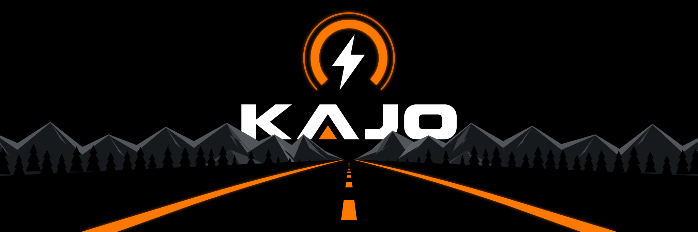
</p>

<p align="center">
  <b>KAJO-Dash</b> is a 320x240 landscape dashboard for electric vehicles, built on the
  ESP32-2432S028R "Cheap Yellow Display".<br>
  It shows live telemetry from a VESC or FarDriver motor controller, over a wire or Bluetooth.
</p>

<p align="center">
  
  
  
  
</p>

<p align="center">
  <a href="#getting-started">Getting started</a> ·
  <a href="docs/wiring.md">Wiring</a> ·
  <a href="docs/development.md">Development</a> ·
  <a href="docs/README.md">All docs</a>
</p>

<!-- Photos and videos of real builds go here. -->

## Themes

<table>
  <tr>
    <td align="center" width="25%">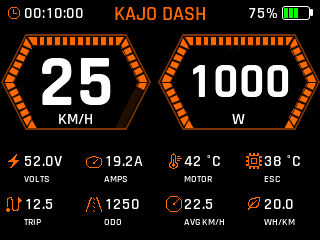<br>Cyber HUD</td>
    <td align="center" width="25%">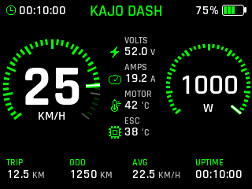<br>Dual Gauge</td>
    <td align="center" width="25%">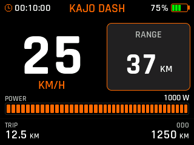<br>Simple</td>
    <td align="center" width="25%">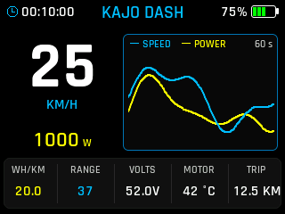<br>Trace</td>
  </tr>
  <tr>
    <td align="center" width="25%">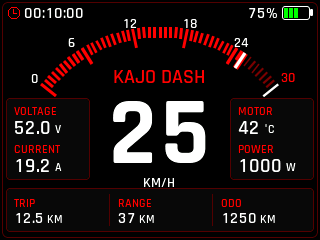<br>Redline</td>
    <td align="center" width="25%">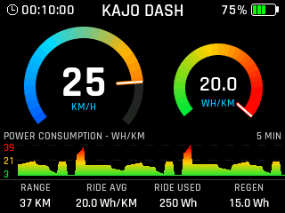<br>Efficiency</td>
    <td align="center" width="25%">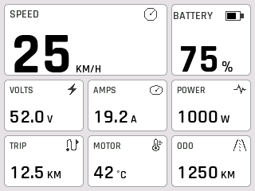<br>Large Tiles</td>
    <td align="center" width="25%">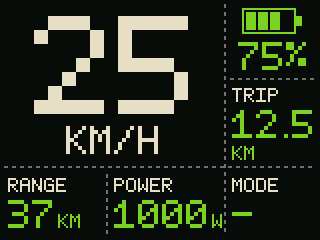<br>Pixel Gauge</td>
  </tr>
  <tr>
    <td align="center" width="25%">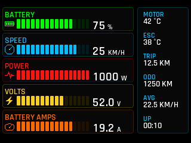<br>Bar Graph</td>
    <td align="center" width="25%">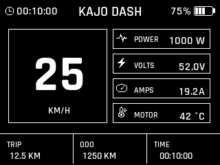<br>Pixel Mono</td>
    <td align="center" width="25%">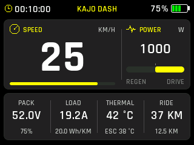<br>Big Readout</td>
    <td align="center" width="25%">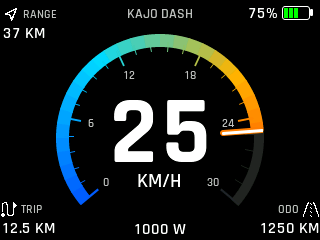<br>Minimal Ride</td>
  </tr>
</table>

Every theme also has a light appearance, and its own accent colour, background and data fields.

## Settings and ride replay

<table>
  <tr>
    <td align="center" width="25%">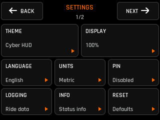<br>Settings</td>
    <td align="center" width="25%">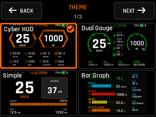<br>Theme selector</td>
    <td align="center" width="25%">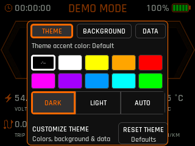<br>Theme colours</td>
    <td align="center" width="25%">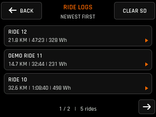<br>Ride logs</td>
  </tr>
  <tr>
    <td align="center" width="25%">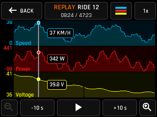<br>Ride replay</td>
    <td align="center" width="25%">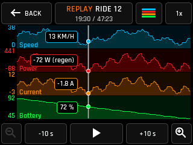<br>Replay, four charts</td>
    <td align="center" width="25%">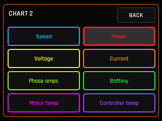<br>Chart fields</td>
    <td align="center" width="25%">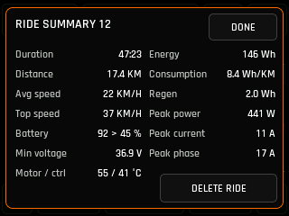<br>Ride summary</td>
  </tr>
</table>

Rides logged to the microSD card can be replayed on the display: scrub through the ride, zoom in on a
stretch of it, chart up to four values at once, and read the ride summary.

These screenshots are real LVGL framebuffer captures, not mockups.
[`contact_sheet.png`](preview_output/lvgl/contact_sheet.png) shows every theme in dark and light, every
settings screen, and the ride replay views.

## Features

- **Twelve dashboard themes** with per-theme accent, background, gradient,
  light/dark appearance and configurable data fields
- **VESC telemetry** over wired UART or Bluetooth LE, with discovery and
  saved-device reconnect
- **Battery estimates**: state of charge from resting voltage plus coulomb
  counting, learned pack resistance, range and Wh/km
- **Ride logging** to a microSD card, with automatic start and stop, and
  on-device ride replay
- **Signed firmware updates over Bluetooth**, with rollback-safe dual-slot OTA
- **Auto-brightness** from the front light sensor, and an optional ambient RGB
  LED that follows the accent colour
- First-boot setup, PIN lock, six languages, metric, imperial and nautical units
- Works on both CYD panel revisions (ILI9341 and the ST7789-type), detected
  automatically

## Status

| Controller | Link | State |
| --- | --- | --- |
| VESC | UART (wired) | Working |
| VESC | Bluetooth LE | Working |
| FarDriver | Bluetooth LE | Prototype: connection and diagnostics work, telemetry decoding is unverified |

There are no tagged releases yet. Expect settings and ride-log formats to change
without migration until the first one.

## Safety

Currently this firmware just displays and records telemetry (Though profiles and settings adjustment support is coming). 
It does not control the vehicle, and it is not safety equipment. 
Range, state of charge and wear estimates are derived, and can drift from reality;
check anything important with VESC Tool or a meter.
Wiring mistakes on an electric vehicle can destroy a controller or start a fire.
If you are unsure about the wiring, do not guess.

## What you need

- **Display:** Sunton ESP32-2432S028R ("CYD"), either panel revision. ESP32, 4 MB
  flash, no PSRAM.
- **Controller:** a VESC-based controller (UART or Bluetooth), or a FarDriver
  (Bluetooth).
- **For a wired link:** four jumper wires (shielding might be useful on higher voltage systems) or a JST cable to the controller's COMM port.
- **Optional:** a microSD card for ride logging. Can be anything, from a hundred MB and up.

## Getting started

### 1. Flash the firmware

The easiest way is the Windows installer. It needs nothing else installed: no
Python, no PlatformIO.

1. Download `KAJO-Dash-Firmware-v…-Windows.zip` from the
   [latest release](https://github.com/evcollector/kajo-dash/releases/latest).
2. Extract every file from the ZIP (right-click it, **Extract All**).
3. Connect the CYD to the computer with a USB **data** cable. Charge-only
   cables do not work.
4. Double-click `Install or Update KAJO-Dash.bat`.
5. Choose **1. Install over USB cable**.
6. Leave the cable connected until the display restarts into KAJO-Dash.

**Display not found?** Hold the **BOOT** button on the CYD, tap **RST**, and
keep holding BOOT until writing starts. If no USB device shows up at all, the
installer links the USB drivers the board needs (Windows usually installs them
by itself).

Reinstalling keeps the settings already on the display.

> [!NOTE]
> No release has been published yet. Until the first one, use
> [Build from source](#build-from-source) below.

**Updating later** needs no cable:

1. Download and extract the newer release, as above.
2. On the display, open **Settings > Information > Bluetooth Link**.
3. Double-click `Install or Update KAJO-Dash.bat` and choose
   **2. Update over Bluetooth**.
4. Keep the display powered until it verifies the update and restarts.

<a name="build-from-source"></a>
<details>
<summary><b>Build from source</b> (macOS, Linux, or developers)</summary>

<br>

You need [PlatformIO](https://docs.platformio.org/en/latest/core/installation/index.html):

```bash
git clone https://github.com/evcollector/kajo-dash.git
cd kajo-dash
pio run -e kajo -t upload
```

On Windows you can instead double-click `kajo.bat` in the checkout and choose
**4. Flash over USB**. If PlatformIO is missing, it offers to install it.

</details>

### 2. Connect the controller

**Bluetooth:** nothing to wire beyond power. The first-boot setup finds the
controller and pairs with it.

**Wired VESC UART:** four wires from the controller's COMM port to the CYD.

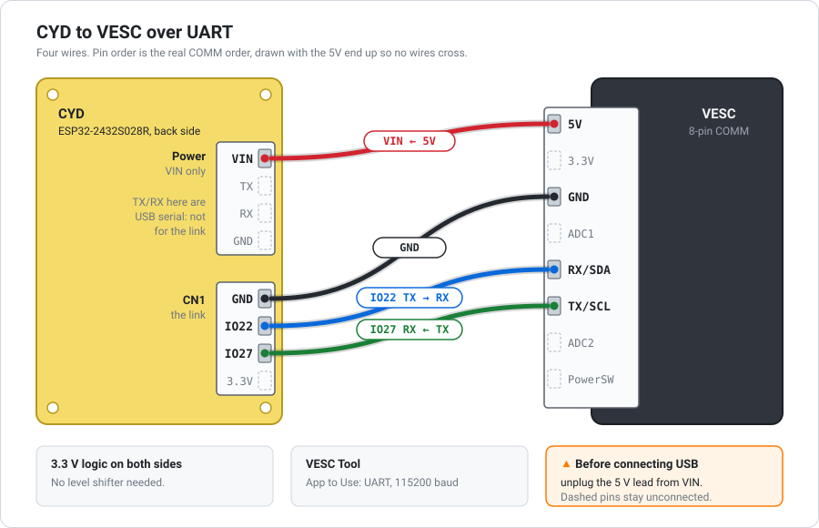

| VESC COMM | CYD | CYD connector |
| --- | --- | --- |
| `TX` | `IO27` | CN1 |
| `RX` | `IO22` | CN1 |
| `GND` | `GND` | CN1 |
| `5V` | `VIN` | VIN/TX/RX/GND |

- The link goes on **CN1** (`GND, IO22, IO27, 3.3V`). The other 4-pin
  connector is only for power. Its `TX`/`RX` pins are the USB serial port.
- Leave `3.3V`, `ADC1`, `ADC2` and `PowerSW` unconnected.
- In VESC Tool, set **App to Use** to `UART` and the baud rate to 115200.
- Unplug the 5 V lead before connecting USB to the CYD.
- If updates drop out under throttle, use a short shielded cable routed away
  from the phase leads; a USB 2.0 cable with its plugs cut off works. See
  [Cable and noise](docs/wiring.md#cable-and-noise).

[docs/wiring.md](docs/wiring.md) has the full reasoning, electrical notes, a
bring-up order and the CYD pin map.

### 3. First boot

The display offers a first-boot setup that walks through the controller link
and vehicle details. It can be skipped; the same options are in Settings. The
dashboard shows `WAITING FOR VESC` until telemetry arrives, usually within a
second of a working link.

## If the touchscreen stops responding

A bad touch calibration can make the settings menu impossible to reach.
**Press and hold anywhere on the dashboard for five seconds**: nothing happens
for two seconds, then a progress ring fills, and releasing early cancels.
Calibration runs when the ring completes. Afterwards the display offers to
reset settings, controller pairing and logging mode too. The on-board BOOT
button works in place of a touch, and the gesture is disabled while the vehicle
is moving.

If a stored setting stops the firmware reaching the dashboard at all, hold the
panel (not the BOOT button) from power-on. The splash stays up until the hold
is unambiguous, and a second hold confirms the settings reset.

## Documentation

| | |
| --- | --- |
| [Wiring](docs/wiring.md) | Controller wiring, power, pin map |
| [Development](docs/development.md) | Building, simulator, preview renderer, tests, releases |
| [Firmware updates](tools/firmware_update/README.md) | Bluetooth uploader, signing, installing your own builds |
| [Releases](RELEASES.md) | Every published firmware version, with its firmware SHA-256 |
| [Test senders](docs/test-senders.md) | Flash a spare CYD as a fake VESC or FarDriver |
| [All docs](docs/README.md) | Protocols, formats, design contracts |

## Contributing

Bug reports and protocol findings are welcome, with or without a patch. Start
with [CONTRIBUTING.md](CONTRIBUTING.md) and the [development guide](docs/development.md).
Project-owned firmware source has one additional licence grant so it can also
ship in KAJO Companion and authorised KAJO-Dash products. [CLA.md](CLA.md)
defines the scope, and the pull request template records agreement.

## Licence

GPL-3.0-or-later. See [LICENSE](LICENSE). This matches the VESC ecosystem:
VESC firmware, VESC Tool, and DAVEga are all GPL-3.0, so code can move between
these projects.

Third-party components, including fonts and libraries compiled into the
firmware, are listed in [THIRD-PARTY-NOTICES.md](THIRD-PARTY-NOTICES.md), with
full texts in [licenses/](licenses/).

**Commercial licensing:** contact@evcollector.com. If the GPL does not suit
what you want to build, other arrangements may be possible under the
permissions described in [CLA.md](CLA.md).

## Disclaimer

KAJO-Dash is an independent hobby project. *Kajo* is a Finnish word for a glow
or faint light. It does not refer to any company or product with the same name,
and the project is not affiliated with or endorsed by any of them.

VESC is a trademark of Benjamin Vedder. FarDriver, ESP32, and other brand names
belong to their owners and are used only to describe what this display
connects to or runs on.
