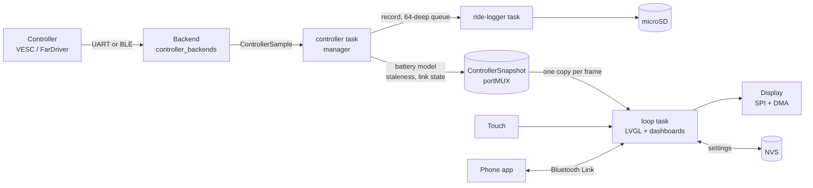

# Architecture

How the firmware is put together: what it is built on, which code runs where,
and how data moves from the controller to the screen. It is a map for people
changing the firmware. The contracts it points to are binding; this page is not.

## Stack

| Layer | What | Version | Where it shows up |
| --- | --- | --- | --- |
| MCU | ESP32 (classic, dual-core Xtensa LX6), 4 MB flash, no PSRAM | — | Sunton ESP32-2432S028R "CYD" |
| Build | PlatformIO, `espressif32` platform | 7.0.1 | `platformio.ini`, env `kajo` |
| Framework | Arduino core for ESP32, on ESP-IDF and **FreeRTOS** | 2.0.17 | `setup()` / `loop()`, tasks, queues, mutexes |
| UI | **LVGL** | 8.4.0 | `src/lvgl_app/`, configured by `include/lv_conf.h` |
| Display driver | TFT_eSPI, with DMA | 2.5.43 | `src/main_lvgl.cpp` (flush callback), boot splash |
| Bluetooth LE | NimBLE-Arduino | 2.5.1 | VESC and FarDriver clients, companion and update servers |
| Storage | NVS (`Preferences`), microSD (`SD`), two OTA slots | — | Settings, ride logs, firmware updates |
| Language | C++ (Arduino flavour), `-O2` | — | Fonts are generated C files |

Exact versions and licences are in [THIRD-PARTY-NOTICES.md](../THIRD-PARTY-NOTICES.md).
The host-side tooling (CMake and MSVC for the simulator, Python for the
generators, Emscripten for the web simulator) is described in
[development.md](development.md) and [simulator.md](simulator.md); none of it
ships on the device.

## Source layout

| Path | Role |
| --- | --- |
| `src/main_lvgl.cpp` | Entry point: `setup()`, `loop()`, display flush, touch, backlight, boot splash, calibration |
| `src/lvgl_app/screens.cpp` | Every screen and dialog; popups and navigation |
| `src/lvgl_app/dashboards.cpp` | The twelve dashboard themes |
| `src/lvgl_app/ui_common.cpp`, `ui_style.h` | Shared components and design tokens ([ui-components.md](ui-components.md)) |
| `src/lvgl_app/app_logic.cpp`, `app_state.h` | Settings, persistence, battery model, language, units |
| `src/lvgl_app/controller_manager.*`, `controller_backends.*` | The controller boundary: one task, interchangeable backends |
| `src/lvgl_app/vesc_*`, `fardriver_*` | Protocol code and Bluetooth workers for each controller |
| `src/lvgl_app/ride_logger.cpp`, `ride_replay*.{cpp,h,inc}` | microSD logging and on-device replay |
| `src/lvgl_app/companion_ble.*` | Bluetooth Link server for the phone app |
| `src/lvgl_app/firmware_update*.{cpp,h}` | Signed over-the-air update |
| `src/vesc_test/`, `src/fardriver_test/` | Separate firmwares that impersonate a controller |

`src/lvgl_app/` is also compiled for the host, with the hardware boundary
replaced (`CYD_LVGL_PREVIEW`). There is no second implementation of any screen.

## Execution model

LVGL is **not** run from a FreeRTOS task of its own. The Arduino `loop()` calls
`lv_timer_handler()` and then services the Bluetooth link and update state
machines, sleeping 5 ms between passes. Everything that talks to a controller,
the card, or the radio lives in a separate task.

| Context | Core | Priority | Stack | Created in | Does |
| --- | --- | --- | --- | --- | --- |
| Arduino `loop` task | 1 (Arduino default) | 1 (Arduino default) | Arduino default | the core | LVGL, touch, display flush, UI logic, companion and update service calls |
| `controller` | 0 | 1 | per backend (4096 for VESC UART) | `controller_manager.cpp` | Polls the active backend, applies the battery model, publishes the snapshot, feeds the ride logger |
| `vesc-ble` | 0 | 1 | 4096 | `vesc_ble.cpp` | VESC Bluetooth client: scan, connect, request/response |
| `fardriver-ble` | 0 | 0 | 4096 | `fardriver_ble.cpp` | FarDriver Bluetooth client |
| `ride-logger` | 0 | 0 | 4096 | `ride_logger.cpp` | Owns the SD card: writes records, lists and exports rides |
| `firmware-update` | 0 | 1 | 6144 | `firmware_update_ble.cpp` | Verifies and writes an incoming image (update mode only) |
| `ride-replay` | any (unpinned) | 1 | 6144 | `ride_replay.cpp` | Reads a ride from SD for the replay screen; exists only while a replay is open |
| NimBLE host | 0 (library default) | library | library | NimBLE-Arduino | The Bluetooth stack |

Notes that are easy to get wrong:

- **Controller backends are not tasks.** `controller_manager` owns the single
  telemetry task and calls the active backend's `poll`. Adding a backend adds no
  task. See [controller-backend-interface.md](controller-backend-interface.md).
- **Priority 0 tasks run at the idle priority.** The ride logger and FarDriver
  worker call `vTaskDelay(1)` inside long loops so the idle task on core 0 can
  run and the task watchdog stays fed.
- **UART is polled, Bluetooth is event-driven.** The VESC UART link uses
  `HardwareSerial(2)` from the manager task. The Bluetooth backends use their
  own worker plus the manager task.
- **One Bluetooth central connection.** `CONFIG_BT_NIMBLE_MAX_CONNECTIONS=1`;
  the peripheral roles (companion, update) only run when the user asks, and the
  controller link is paused or disconnected first, then resumed afterwards.

## Data flow

The important property: **the UI never sees a half-updated state.** The
manager publishes one `ControllerSnapshot` under a lock; `screens.cpp` copies it
once per frame and hands the values plus a field-availability mask to the
dashboard. Themes contain no controller or transport branches.

### Display

LVGL renders RGB565 into two 320 × 26 line buffers. The flush callback hands one
to TFT_eSPI's DMA engine while LVGL renders the other. The panel is on its own
SPI bus (HSPI) which is held open permanently, so nothing else may use it after
`setup()`. The microSD card is on VSPI. Touch is read by a small software
XPT2046 reader (`SoftXpt2046`), because the classic ESP32 exposes only two
application SPI peripherals. LVGL uses `malloc` for its heap (`LV_MEM_CUSTOM`)
and `millis()` for its tick.

### Storage

| Data | Where | Owner |
| --- | --- | --- |
| Settings, themes, saved controllers, lifetime totals | NVS via `Preferences` | `app_logic.cpp` and the backends |
| Ride logs | microSD, [ride-log-format.md](ride-log-format.md) | `ride-logger` task only |
| Firmware | two 0x1F0000 OTA slots, plus `otadata` and a core-dump partition | `firmware_update.cpp`, [ota-update-design.md](ota-update-design.md) |

## Threading rules

These are the rules the code already follows. They exist because the failure
modes are subtle: tearing, watchdog resets, and corrupted NVS.

1. **Only the loop task touches LVGL objects.** Other tasks hand data over
   through the snapshot, queues, or status structs, and the UI polls them.
2. **Short shared state uses `portMUX_TYPE` critical sections** (the snapshot,
   backend status, companion command slot). Nothing that can block goes inside
   one.
3. **Anything that blocks uses a FreeRTOS mutex or queue.** The battery
   preferences use a recursive mutex, not a critical section, because NVS writes
   block and blocking inside a critical section panics the core
   ([design-decisions.md](design-decisions.md)). Two tasks must never share one
   `Preferences` handle unguarded.
4. **The SD card has one owner.** The UI asks the `ride-logger` task, through its
   queue, rather than opening files itself.
5. **Long work yields.** Loops on core 0 that run longer than a tick call
   `vTaskDelay(1)` so the idle task runs.
6. **Radio hand-offs are the manager's job.** A backend or mode switch is
   performed by the telemetry task, which waits for the old worker to release
   the single Bluetooth slot; the UI thread never blocks on it.

## Boot sequence

`setup()` in `main_lvgl.cpp` runs in this order: load settings and the display
panel profile, initialise the panel and draw the splash through TFT_eSPI, start
the touch reader and load its calibration (boot recovery runs here), start the
ride logger, load battery statistics and start the controller manager, run the
first-boot touch calibration if nothing is saved, then enable DMA, initialise
LVGL, register the display and touch drivers, and build the first screen. The
controller and logger tasks are therefore already running before the UI exists,
which is why the UI only ever reads published state. The update subsystem keeps a new firmware image in the pending state until
`setup()` has finished and the LVGL loop has run healthily, so a build that
hangs on boot rolls back.

## Build variants

| Environment | Purpose |
| --- | --- |
| `kajo` | The dashboard firmware (default) |
| `kajo_test_package` | The same firmware, labelled `-test` on screen, built by the release tool |
| `fardriver_test`, `vesc_test` | Fake controllers for a spare CYD ([test-senders.md](test-senders.md)) |

## Where to read next

- Adding or changing a controller: [controller-backend-interface.md](controller-backend-interface.md)
- Editing a screen: [ui-components.md](ui-components.md)
- Phone link and updates: [companion-protocol.md](companion-protocol.md), [ota-update-design.md](ota-update-design.md)
- Why a thing is the way it is: [design-decisions.md](design-decisions.md)
